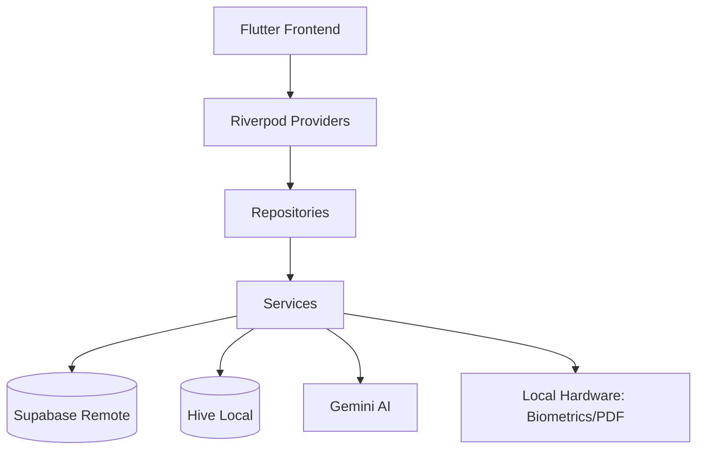

# Clear Health Architecture

This document describes the technical architecture and choices made for the Clear Health application.

## 🏗 System Overview

Clear Health follows a modern, layered Flutter architecture designed for scalability, maintainability, and security.



## 📱 Frontend (Flutter)

- **State Management**: `flutter_riverpod` is used for global state management. It provides a robust, testable, and compile-safe way to manage application logic.
- **Navigation**: Declarative routing for seamless transitions between features.
- **Theming**: A unified `ClearHealthTheme` that supports high-contrast, premium aesthetics with ambient background effects.
- **Icons & Fonts**: Google Fonts (Inter/Roboto) and FontAwesome for a professional UI.

## 💾 Data Layer

### Persistence

- **Remote (Supabase)**: Primary data store using PostgreSQL with `pgvector` for AI-powered semantic search capabilities. Supabase also handles:
  - **Authentication**: Secure JWT-based auth.
  - **Storage**: PDF lab report storage.
  - **Real-time**: Syncing data across devices.
- **Local (Hive)**: High-performance NoSQL storage for offline caching, ensuring the app remains functional without an internet connection.

### Security

- **Row Level Security (RLS)**: Enforced in Supabase to ensure users can only access their own data.
- **Biometrics**: `local_auth` integration for an extra layer of local security.
- **Secure Storage**: `flutter_secure_storage` for sensitive credentials.

## 🧠 AI Integration

Clear Health leverages the **Google Gemini AI Engine** (via `google_generative_ai`):

- **Semantic Embeddings**: Converting lab results into vector representations for intelligent comparisons.
- **Generative Insights**: Using LLMs to interpret raw medical data into human-readable insights.
- **Health Chat**: A RAG (Retrieval-Augmented Generation) inspired chat system for queries against medical history.

## 🛠 Core Services

- **PDF Service**: Handles generation and rendering of health reports using `pdf` and `printing`.
- **Notification Service**: Manages local scheduled notifications for medications and reminders.
- **Storage Service**: Wrapper around Supabase Storage for secure file handling.
- **Biometric Service**: Abstracts biometric verification logic.
- **Vector Service**: Interfaces with the AI vector database for similarity searches.

## 📁 Directory Structure

The project follows a **Feature-First** structure:

```text
lib/
├── core/                # Shared services, models, and global providers
│   ├── services/        # Concrete implementation of business logic
│   ├── providers/       # Global state providers
│   └── utils/           # Helper functions and extensions
├── features/            # Feature-specific modules
│   ├── lab_results/     # Lab report management
│   ├── trends/          # Data visualization
│   ├── chat/            # AI interaction
│   └── security/        # Security monitoring UI
└── main.dart            # Entry point and global configuration
```
